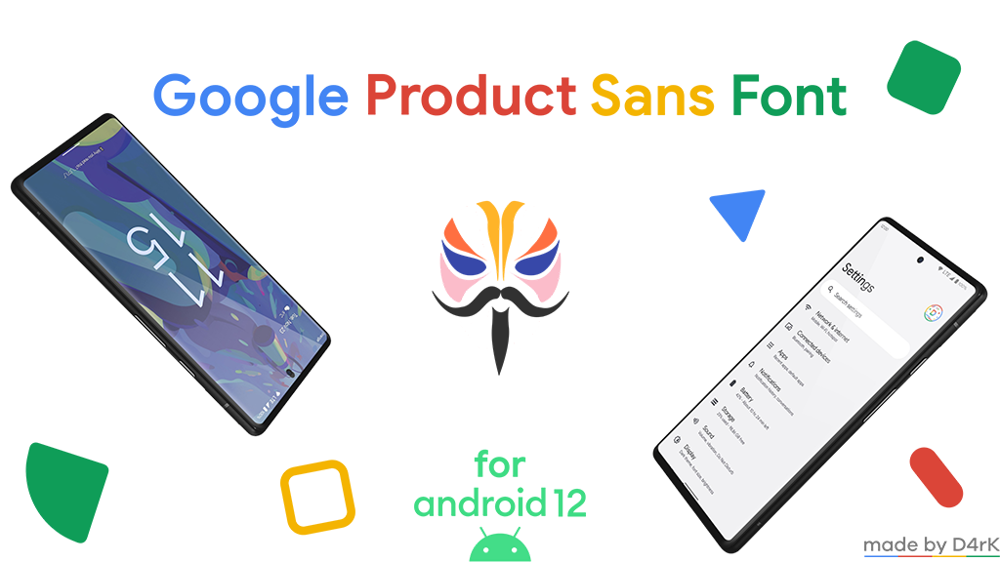

# Google Product Sans Font for Android 12

- ╔╦╦╦═╦╗╔═╦═╦══╦═╗
- ║║║║╩╣╚╣═╣║║║║║╩╣
- ╚══╩═╩═╩═╩═╩╩╩╩═╝

This module helps you to install Google Product Sans Font systemlessly through Magisk. This module is made to be compatible with Android 12.

### Download.
You can download module from here and flash in Magisk.

Features:
- Replace all system fonts with Google Product Sans Font;
- Android 12.1 emojis added.

Bugs?
- I can't say is a bug but everyone have his own perspective put I miss some fonts because I was lazy. Maybe I'll add the missing fonts in the future update. XD
- You tell me.

### Tested on Redmi Note 10 Pro (sweet) - Pixel Experience Android 12.

  
Special Thanks

- Thanks [Looki75](https://github.com/Looki75) for [looki75productsansfont](https://github.com/Looki75/looki75productsansfont);

### 👨🏻‍💻 &nbsp;More About Me:

